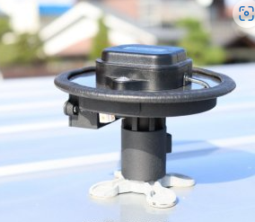

# ActiveKineticSeat

## GPS（位置情報）
- 実行ファイル　：　gps_bt_receiver.py

今回試しに使ってみたGPSデバイスは、DroggerのRWPです。

[RWP - DG-PRO1RWS、アクティブアンテナ、グランドプレーン、電源、三脚アタッチメント一体型コンパクトパッケージ - BizStation Corp](https://www.bizstation.jp/ja/drogger/rwp_index.html?tab=rwp)

まずはGPS計測デバイスと計測PCのペアリングを行います。GPSデバイスのスイッチをONにしてください。

ペアリング方法は下記サイトにあります。

[RWS・RZSシリーズ受信機をWindowsで使う - Beyond your wall with Drogger (hatenadiary.jp)](https://drogger.hatenadiary.jp/entry/dgpro1rw_windows)

計測PCでGPSデバイスがどのCOMに割り当てられているか、確認してください。

確認した番号をconfig.pyの"GPS_PORT"に設定してください。（例：GPS_PORT = "COM9"）

以上で基本的な設定は完了です。